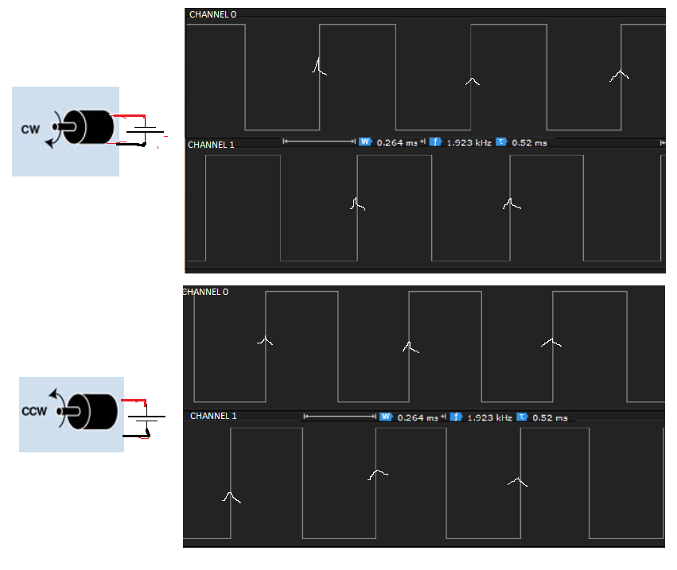

# Decoding Rotary Encoders With STM32
After Tearing down an Old HP printer I found this nicely connected incremental rotary encoder connected with a motor, 
I tried to interface the same sensor with my Stm32f411 mcu, with out writing many lines of code.

